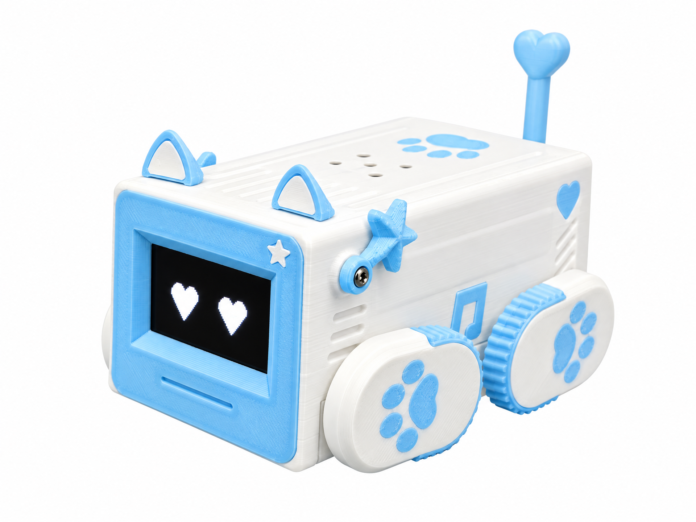

# caiyu-dog（菜魚犬）

[中文](README_zh.md) | [English](README.md) | [日本語]

## 1. プロジェクト紹介

菜魚犬（caiyu-dog）は、**見た目にもこだわった四足のデスクトップロボット犬**です。XiaoZhi 音声アシスタントに 4 本のサーボ脚、2 本の WS2812 テープ、タッチパッドを追加した構成で、ESP32-C3 が音声と表示を担当し、128x64 OLED が顔（まばたきする幾何学的な目）、脚が立ち・座り・歩き・ダンスを担当します。

本リポジトリはボード実装を **`caiyu-c3`** の 1 つだけに絞り込んでおり、他のボードはすべて削除済みです。

### QQ グループで交流

- グループ番号：1028667976（4 群）



<!-- 上の写真：実体は docs/caiyu-dog.png です。別の画像を使う場合はパスを変更するか、行ごと削除してください -->

**できること**

- **音声対話**：ESP-SR のオフライン wake word。タッチ 1 回で会話を開始／終了し、起きるときは立ち上がります
- **表情**：21 種類の幾何学的な目。待機中は自動で「おやすみ」（半目・呼吸のような上下動・Zzz）
- **脚のアクション**：立ち／座り／伏せ／前進後退／左右旋回／手を振る／伸び／スイング／引っかき など。音声でも Web からでも指示できます
- **ムードムーブ**：会話中に感情に合わせた小さな脚の動き
- **LED テープ**：常灯／ブリーズ／レインボー／フロー／フラッシュ。色・明るさ・速度を調整可能
- **Web コンソール**：Wi-Fi 接続後に `http://<デバイスIP>/` を開くか、タッチを 1 秒長押しして画面に QR コードを表示
- **サーボ微調整**：脚ごとに ±20° の補正を Web から設定し、NVS に保存

## 2. 組み立てと配線

### 2.1 必要な部品

- **開発ボード**：ESP32-C3 SuperMini（4MB Flash）
- **デジタルマイク**：INMP441 / ICS43434
- **アンプ**：MAX98357A
- **スピーカー**：8Ω 2~3W または 4Ω 2~3W
- **ディスプレイ**：SH1106 OLED、128x64、I2C
- **タッチモジュール**：TTP223 系（**3.3V 給電必須**）
- **LED テープ**：WS2812 / WS2812B、4 個
- **サーボ**：180° サーボ ×4（SG90 / MG90S クラス）
- **抵抗**：2kΩ ×1（タッチ側の保護用）
- **USB Type-C ケーブル** と書き込み用 PC

他に、テスターとはんだごてセットがあると便利です。

### 2.2 ピン対応表

| 機能 | GPIO | 備考 |
| --- | --- | --- |
| マイク WS / SCK / DIN | 7 / 6 / 5 | I2S 入力 |
| アンプ LRCK / BCLK / DOUT | 4 / 3 / 2 | I2S 出力 |
| OLED SDA / SCL | 8 / 9 | I2C、アドレス 0x3C |
| タッチパッド + LED テープ DIN | 0 | **1 本の線を共用**（時分割） |
| 左前サーボ | 1 | LEDC 駆動 |
| 右前サーボ | 10 | LEDC 駆動 |
| 左後サーボ | 20 | LEDC 駆動 |
| 右後サーボ | 21 | LEDC 駆動 |

**配線の注意：**

1. **サーボを開発ボードから給電しない**：4 個同時に動かすと瞬間的に 1.5A 以上流れます。独立した電源を使い、**GND は必ず共通**にしてください。
2. **タッチモジュールは 3.3V 給電**：5V だと OUT が 5V になり、ESP32-C3 の入力耐圧を超えて破損のおそれがあります。
3. **2kΩ はタッチ側だけに**：LED テープのデータ線に直列に入れると WS2812 の 800kHz タイミングが崩れます。
4. **GPIO20 / GPIO21 は C3 の UART0 既定ピンでもあります**：サーボを接続したら USB（Serial/JTAG）側でログを見てください。USB-シリアル変換チップのみのボードでは、この 2 ピンがサーボに使われている間ログが見えません。
5. **GPIO8 / GPIO9 は strapping ピン**で、多くの C3 ボードでは基板上 WS2812 のピンでもあります。OLED に使うと基板 LED が I2C 通信に合わせてちらつくことがありますが、正常な動作です。

### 2.3 機械的な組み立てと調整

脚は対角に対称に取り付けます（左前／右前／左後／右後）。コード側で右側の 2 本はミラー処理しているため、「両方の前脚を前に出す」は同じ角度値になります。

サーボホーンがずれていたり左右が非対称でも、コードを書き換える必要はありません。コンソールの「設定」タブで各脚の微調整スライダーを動かし、「デバイスに保存」を押せば再起動後も保持されます。

## 3. 書き込み

### 3.1 ローカルでビルド（ESP-IDF）

ESP-IDF **v6.0.2** が必要です：

```sh
source /path/to/esp-idf/export.sh

python scripts/build.py caiyu-c3      # 設定とビルド
idf.py -p <ポート> flash monitor        # 書き込みとログ表示
```

Wi-Fi 接続後、ログにコンソールの URL が出ます：

```text
I (1234) CaiyuC3Board: control page: http://192.168.1.23/
```

### 3.2 Web 書き込み

【Web 書き込みページがある場合はここに URL を記入。無ければこの節を削除】

### 更新履歴

> ファームウェアを公開するたびに 1 行追加してください。

- **現在**：音声対話、21 種類の目の表情、脚のアクションとムードムーブ、LED 5 種類の演出、Web コンソール（リモコン／表情／ライト／設定）、画面 QR コード、サーボ微調整の保存

## 4. クレジットとライセンス

[78/xiaozhi-esp32](https://github.com/78/xiaozhi-esp32) をベースにしています。目の幾何学的な描画は `esp32-sh1106-oled-emojis`、脚のアクションと LED 演出は `zzpet` を参考にしました。

MIT。[LICENSE](LICENSE) を参照してください。
